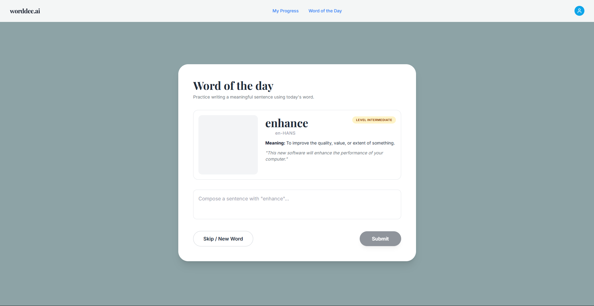
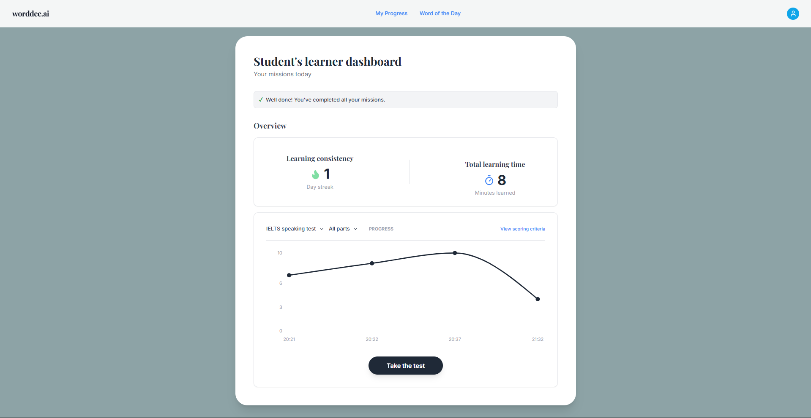

# ✍️ Worddee.ai: AI-Powered English Vocabulary Coach

**Worddee.ai** คือเว็บแอปพลิเคชันฝึกภาษาอังกฤษที่ช่วยให้ผู้เรียนฝึกแต่งประโยคจากคำศัพท์ประจำวัน (Word of the Day) โดยมี AI คอยตรวจไวยากรณ์ ให้คะแนน และแนะนำประโยคที่สละสลวยกว่า พร้อมระบบ Dashboard ติดตามพัฒนาการของผู้เรียนแบบ Real-time

---

## 📸 App Screenshots

| Word of the Day Challenge | Learner Dashboard |
|:---:|:---:|
|   |  |
| *หน้าสุ่มคำศัพท์และแต่งประโยค* | *หน้าสรุปผลการเรียนและกราฟพัฒนาการ* |

---

## 🚀 Getting Started

ทำตามขั้นตอนด้านล่างเพื่อรันโปรเจกต์นี้บนเครื่องของคุณ (Localhost)

### 1. Prerequisites (สิ่งที่ต้องมี)
* **Docker & Docker Compose** (สำคัญมาก - ต้องติดตั้งและเปิดโปรแกรมไว้)
* **Git** (สำหรับ Clone Project)
* **Gemini API Key** (ขอฟรีได้ที่ [Google AI Studio](https://aistudio.google.com/app/apikey))

### 2. Clone Repository
เปิด Terminal แล้วพิมพ์คำสั่ง:
```bash
git clone [https://github.com/ffourwheel/WebWord](https://github.com/ffourwheel/WebWord)
cd WebWord

# สร้างไฟล์ชื่อ .env แล้ววางเนื้อหานี้ลงไป
GEMINI_API_KEY=AIzaSyD_xxxxxxxxxxxxxxxxxxxxxxxxxxxxx
POSTGRES_USER=postgres
POSTGRES_PASSWORD=112233
POSTGRES_DB=webwords_db

docker-compose up --build

## n8n Workflow Setup (สำคัญ!)

เปิด n8n: เข้าไปที่ http://localhost:5678
Sign up: สร้างบัญชี Admin (สำหรับใช้งานในเครื่องตัวเอง)

Import workflows/My workflow.json

## Setup Credentials

Workflow คลิกที่ Node Google Gemini
ในช่อง Credential เลือก Create New > ใส่ Gemini API Key ของคุณลงไป > กด Save

## Active Workflow:
กดปุ่ม Inactive (มุมขวาบน) ให้กลายเป็นสีเขียว Active (ขั้นตอนนี้สำคัญมาก เพื่อให้ API พร้อมรับคำสั่งจาก Backend)
```


## ✨ Key Features (ฟีเจอร์หลัก)

* **🎯 Word of the Day Challenge:** สุ่มคำศัพท์ภาษาอังกฤษแบ่งตามระดับ (Beginner, Intermediate, Advanced) พร้อมคำอ่าน ความหมาย และรูปภาพประกอบ
* **🤖 AI Feedback & Scoring:** ตรวจประโยคด้วย AI (ผ่าน n8n Workflow) ให้คะแนนความถูกต้อง (0-10), ระบุระดับ CEFR และแก้ไขประโยคให้ดีขึ้น
* **📊 Smart Dashboard:**
    * **Progress Chart:** กราฟแสดงแนวโน้มคะแนนย้อนหลัง (Recharts)
    * **Learning Stats:** ระบบนับ Streak (จำนวนวันต่อเนื่อง) และ Total Minutes (เวลาเรียนรวม)
* **💾 Persistent Data:** บันทึกประวัติการเรียนและสถิติทั้งหมดลงใน PostgreSQL

---

## 🛠️ Tech Stack

| Component | Technology | Description |
| :--- | :--- | :--- |
| **Frontend** | **Next.js 14** | React Framework, TypeScript, Tailwind CSS |
| **Visualization**| **Recharts** | Library สำหรับวาดกราฟ Dashboard |
| **Backend** | **FastAPI** | Python Web Framework (High Performance Async) |
| **AI Workflow** | **n8n** | Workflow Automation เชื่อมต่อกับ LLM (Gemini/OpenAI) |
| **Database** | **PostgreSQL** | ฐานข้อมูลหลักสำหรับเก็บ History และ User Stats |
| **Infra** | **Docker** | Containerization สำหรับรันทุก Service พร้อมกัน |

---

## 📂 Project Structure

โครงสร้างไฟล์ของโปรเจกต์เป็นแบบ Monorepo:

```text
worddee-project/
├── 📂 backend/            # FastAPI Application
│   ├── main.py            # API Logic & Endpoints
│   ├── requirements.txt   # Python Dependencies
│   └── Dockerfile         # Backend Container Setup
│
├── 📂 frontend/           # Next.js Application
│   ├── app/               # App Router Pages
│   ├── public/            # Static Assets
│   ├── package.json       # JS Dependencies
│   └── Dockerfile         # Frontend Container Setup
│
├── .env                   # Environment Variables
├── .gitignore             # Git Ignore Rules
├── docker-compose.yml     # Orchestration Config
└── README.md              # Project Documentation